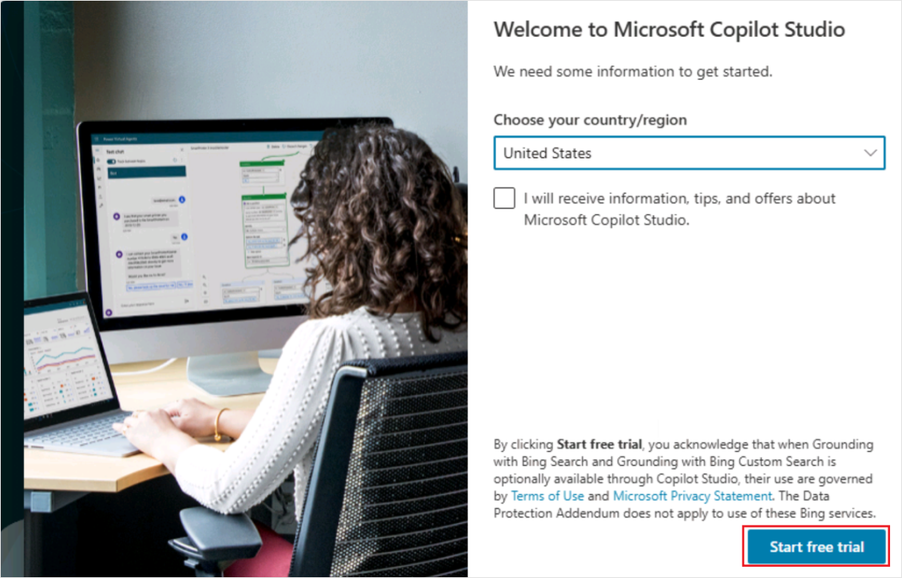
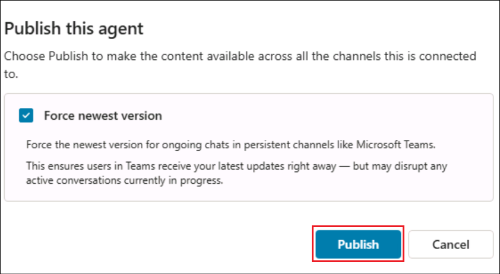
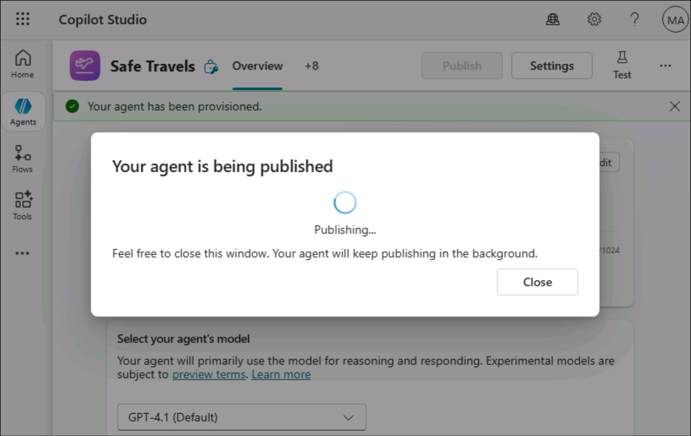
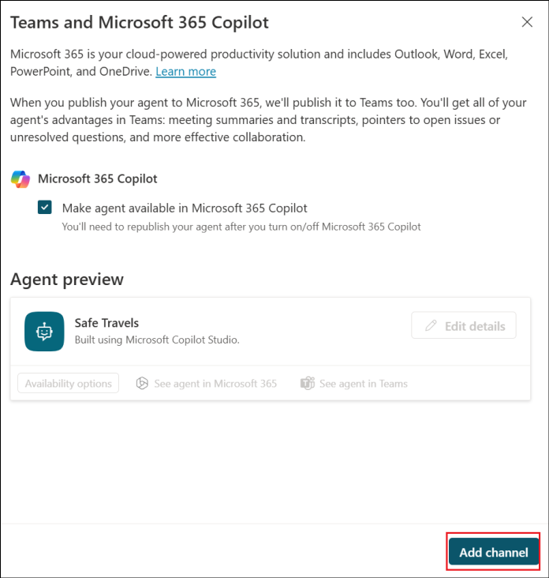
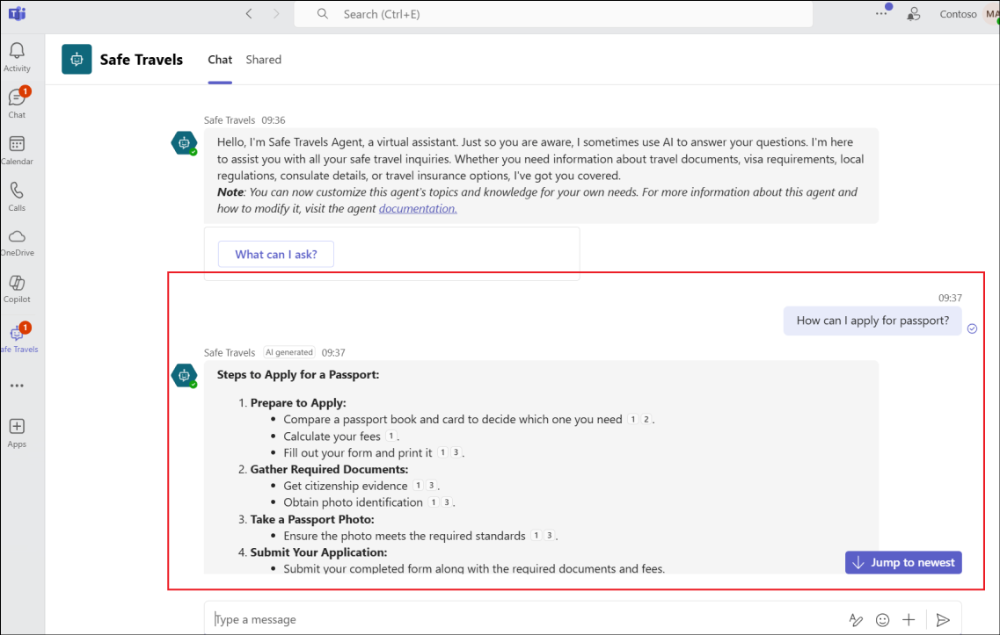
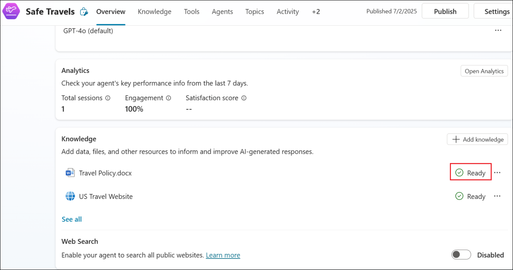

# Lab 2- Build and enhance a template based enterprise assistant

**Objective**

**Agent templates** are designed to help you get started with a **custom
agent**. You are responsible for assessing all safety and legal
implications of using an agent template and customizing it as
appropriate for your business.

An agent built from the **Safe Travels agent template** is a
Business-to-Employee (B2E) agent designed to provide employees of a
company with **travel assistance**. This agent helps ensure employees
are well-prepared and informed for their next work trip. This agent uses
natural language processing to offer a conversational interface, making
it easy and intuitive for employees to access the information they need.
However, the default website used by the agent currently only covers US
travel destinations. You can replace the default website with your own
knowledge source.

## Exercise 1: Create Safe Travels agent from template

In this exercise, you will create the agent in Copilot Studio using the
Safe Travels agent template.

1.  From a newtab, login to +++https://copilotstudio.microsoft.com/+++ 

2.  This open up the **Start free trial** page. Leave the country as **United States** and click **Start free trial**.

    

3.  Select Skip in the Welcome screen.

    

4.  Select **Agents** from the left pane and then select the **Safe
    Travels** template under **Start with an agent template**.

    

5.  The Safe Travels template creates a new agent that is designed to
    provide employees of a company with travel assistance. 

    

7.  Select **Create** to create the Safe Travels agent. We are not
    changing anything here and using the template as such. At any point,
    the agent can be upgraded as per the user requirements.

    

8.  The **agent** gets **created** and opens up automatically showing up
    the **Overview** page.

    

9.  In the **Test** pane, enter +++How to apply for passport?+++ and
    hit **Send**.

    The **Test** pane is open by default. If not, click on the **Test icon** on top
right.

    

10. You can see that the agent provides information on how to apply for
    the passport from its knowledge source.

    

## Exercise 2: Publish the agent to Teams and Microsoft 365 Copilot

In this exercise, you will **publish** the agent created in Copilot
Studio to the **Microsoft Teams** and **Microsoft 365 Copilot** channel.

>[!Alert] **Important:** Since this is a test environment used for training purposes, there might be issues in getting the agent published, based on any recent changes to the product. If that happens, there will be issues in executing the  exercises that follow. This will not be the case in the production.

1.  Open **MS Teams** +++https://teams.microsoft.com/v2/+++ from a
    browser and **login** using your tenant credentials from
    the **Resources** tab if prompted.

2.  Back in the Copilot Studio, select **Publish** from the top right of
    the agent page.

    

3.  Check the **Force newest version** checkbox and then
    select **Publish** in the confirmation dialog.

    
    
    

4.  Select **Channels** from the top navigation bar.

    

5.  Select **Teams and Microsoft 365 Copilot** from the list of
    available channels.

    

6.  Select **Add channel**.

    

7.  Click on the **See agent in Teams** option add the agent to the
    Teams.

    

8.  This opens up the agent in the Microsoft Teams. Select **Cancel** in
    the **This site is trying to open Microsoft Teams** pop up and then
    select **Use the Web App instead** option.

    

9.  Select **Add** to add the agent.

    
    
    

10. Once added, you will get an option to open the agent.
    Select **Open**.

    

11. Test the agent from Teams.

    

12. Back in the Copilot Studio, close the Teams and Microsoft 365
    Copilot channel window.

    

## Exercise 3 – Test the existing Safe Travels agent

In this exercise, we will test the **Safe Travels** agent to see how it
responds when asked about travel approval.

1.  Back in the Copilot Studio -\> Safe Travels agent, select
    the **Test** icon to test the agent.

    

2.  Enter +++Need travel approval+++ in the Test window and click
    on **Enter**.

    

3.  You can see that the agent responds with a generalized instruction
    set to be followed to get the travel approval.

    

## Exercise 4 – Enhance the agent with company specific Knowledge assets

In this exercise, we will add knowledge asset - **Travel
Policy** specific to Contoso.

1.  From the Overview page of the agent, scroll down and select **+ Add
    knowledge**

    

2.  Click on **select to browse** option.

    

3.  From **C:\Labfiles\Lab Files** folder, select **Travel
    Policy.docx** and click **Open**.

    

4.  Click **Add to agent** to the add the file.

    

    

5.  Ensure that the file is added. Wait till the status changes
    from **In progress** to **Ready**. You can continue with the next
    step while it is changing to the Ready state if it takes more than
    few minutes.

    

    >

6.  Now, test the agent with the same question to see that the agent
    responds with the company specific policies from the knowledge asset
    added.

## Summary

In this lab, you created a **Business-to-Employee (B2E) travel
assistance** agent by using the **Safe Travels agent template** in
Microsoft Copilot Studio. You explored how agent templates provide a
quick starting point by preconfiguring conversational capabilities and
knowledge sources, while still allowing for future customization to meet
organizational and legal requirements. Using the built-in **US travel
website** as a **knowledge source**, you tested the agent’s ability to
answer employee travel-related questions through natural language
interactions. Finally, you **published** the agent to **Microsoft Teams
and Microsoft 365 Copilot**, validated its availability in Teams, and
confirmed that employees can access and interact with the Safe Travels
agent directly within their everyday collaboration tools.

 

