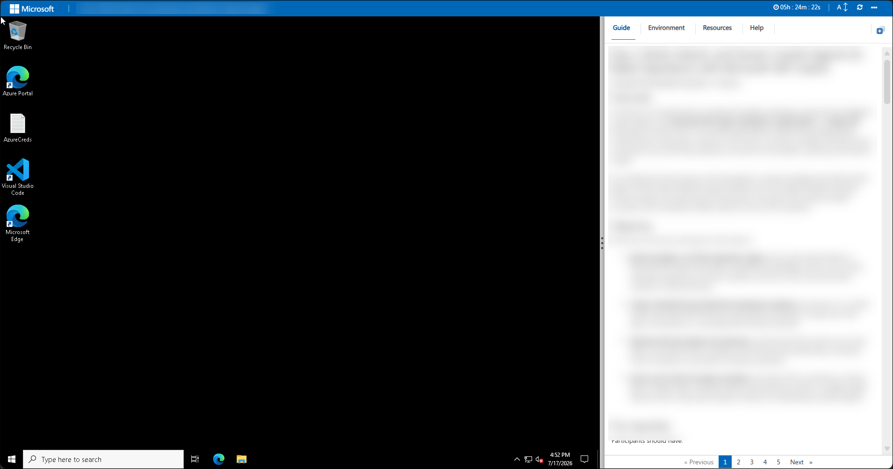
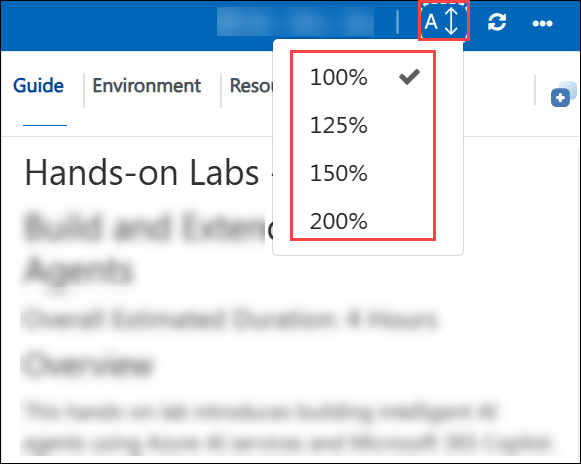
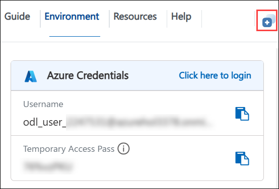
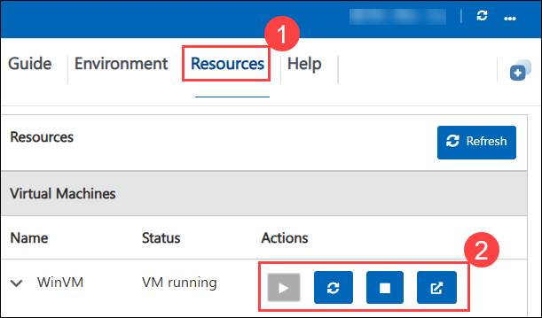

# Hands - on Labs - Day 1

# Day 1: Design and Orchestrate Intelligent Agents with Copilot Studio

### Overall Estimated Duration: 4 Hours

## Overview

In this lab, you will get hands-on experience designing, building, and orchestrating intelligent AI agents using **Microsoft Copilot Studio**. You will progress from creating a simple no-code conversational assistant with the Copilot Studio Agent Builder, to building a data-grounded hiring agent backed by **Microsoft Dataverse**, to transforming that single agent into a scalable **multi-agent system**, and finally to building a fully autonomous agent that uses **Computer-Using Agents (CUA)** to retrieve data from legacy systems without APIs.

By completing this lab, learners will be equipped to author domain-specific conversational agents in natural language, ground agents in enterprise data using Dataverse, orchestrate child and connected agents for complex workflows, automate processes with event triggers and agent flows, and build autonomous agents that interact with systems the way a human would.

## Objective

By the end of this lab, participants will be able to:

- **Design a conversational AI assistant** using the Copilot Studio Agent Builder by describing the agent's purpose, behavior, and tone in natural language, and iteratively refining its instructions to bring a functional, domain-specific Gardening Assistant to life.

- **Create an intelligent hiring agent** for talent acquisition by importing a pre-configured Dataverse solution, populating tables with sample candidate and job-role data, and building a central Hiring Agent orchestrator in Copilot Studio.

- **Transform a single agent into a scalable multi-agent architecture** by adding an Application Intake child agent and an Interview Prep connected agent, configuring agent flows and event triggers, and orchestrating collaboration between the agents.

- **Build an autonomous financial data retrieval agent** using Computer-Using Agents (CUA) that detects email requests through triggers, simulates human interaction with a legacy web system to extract portfolio data, and replies automatically without relying on APIs.

## Pre-requisites

Participants should have:

- A Microsoft 365 account with access to **Microsoft Copilot Studio** and the **Microsoft 365 Copilot** chat experience.

- Access to the **Power Platform admin center** and **Microsoft Dataverse**.

- Access to **Microsoft 365 Outlook** for configuring email-based triggers and responses.

- Basic familiarity with Microsoft 365 applications and conversational AI concepts.

- Understanding of basic business processes such as recruitment and hiring workflows and financial data retrieval.

## Architecture

In this lab, you will use **Microsoft Copilot Studio** together with **Microsoft Dataverse**, the **Power Platform**, the **Microsoft 365 Copilot** chat experience, and the **Office 365 Outlook connector** to design and orchestrate a range of AI agents. The workflow begins with authoring a simple conversational agent through natural-language descriptions in the Copilot Studio Agent Builder, then advances to building a data-grounded hiring agent, extending it into a multi-agent system, and finally deploying an autonomous computer-using agent.

Each agent is grounded in the appropriate knowledge or data source — natural-language instructions, Dataverse tables for candidates, resumes, job roles, and evaluation criteria, or live data retrieved from a legacy web application — and uses AI reasoning to plan, delegate, and act across conversational, orchestrated, and autonomous scenarios.

The Copilot Studio Agent Builder enables no-code creation of conversational agents from a simple description. Dataverse provides trusted, structured storage that grounds the hiring agent. Multi-agent orchestration with child and connected agents, agent flows, and event triggers enables specialized agents to collaborate and automate end-to-end processes. Computer-Using Agents (CUA) allow an autonomous agent to interact with systems that have no API by simulating human actions, while the Office 365 Outlook connector handles email-based triggers and responses.

## Explanation of Components

The architecture for this lab involves the following key components:

1. **Microsoft Copilot Studio:** The primary environment for designing, building, and orchestrating AI agents.
   - Acts as the entry point for creating, configuring, testing, and publishing conversational, orchestrated, and autonomous agents.
   - Provides settings for orchestration, knowledge, triggers, tools, and multi-agent connections.

1. **Copilot Studio Agent Builder:** A no-code experience for building conversational agents from a natural-language description.
   - Lets you define an agent's purpose, behavior, and tone by describing it in plain language and iteratively refining the instructions.
   - Enables rapid creation of purpose-driven assistants, such as a Gardening Assistant, without writing code.

1. **Microsoft Dataverse:** A trusted, structured data platform used to ground agents in enterprise data.
   - Stores hiring data such as candidates, resumes, job roles, job applications, and evaluation criteria imported through a pre-configured solution.
   - Grounds the Hiring Agent and connected agents so responses remain accurate and within approved data boundaries.

1. **Multi-Agent Orchestration (Child and Connected Agents):** A pattern for scaling a single agent into a coordinated team of specialists.
   - Uses child agents for focused, solution-managed tasks such as processing resumes (Application Intake Agent).
   - Uses connected agents for reusable, independently published capabilities such as interview preparation (Interview Prep Agent), with a central Hiring Agent delegating work and passing context.

1. **Agent Flows and Event Triggers:** Automation building blocks that enable deterministic actions and autonomous behavior.
   - Agent flows provide structured, multi-step backend processes such as uploading resumes and performing Dataverse upserts.
   - Event triggers, such as new email arrival, allow agents to proactively respond to external events and act without user interaction.

1. **Computer-Using Agents (CUA):** An AI capability that interacts with systems the way a human would.
   - Simulates human interaction with legacy web applications to securely access and extract data without requiring API integration.
   - Powers an autonomous Portfolio Lookup Agent that navigates a website, searches for a portfolio, and retrieves the requested values.

1. **Office 365 Outlook Connector:** The connector used to handle email-based triggers and responses.
   - Detects incoming email requests through subject-line filtering to initiate automated workflows.
   - Sends replies with the requested data, enabling end-to-end autonomous email-driven automation.

## Getting Started with Lab

Once you're ready to dive in, your virtual machine and **Guide** will be right at your fingertips within your web browser.

## Lab Guide Zoom In/Zoom Out

To adjust the zoom level for the environment page, click the **A↕ : 100%** icon located next to the timer in the lab environment.

## Virtual Machine & Lab Guide

Your virtual machine is your workhorse throughout the workshop. The guide is your roadmap to success.

## Exploring Your Lab Resources

To get a better understanding of your lab resources and credentials, navigate to the **Environment** tab.

## Utilizing the Split Window Feature

For convenience, you can open the lab guide in a separate window by selecting the **Split Window** button from the top right corner.

## Managing Your Virtual Machine

Feel free to **start, restart, or stop (2)** your virtual machine as needed from the **Resources (1)** tab. Your experience is in your hands!

## Let's Get Started with Azure Portal

1. On your virtual machine, click on the Azure Portal icon.

2. You'll see the **Sign into Microsoft Azure** tab. Here, enter your **credentials (1)** and select **Next (2)**:

   - **Email/Username:** <inject key="AzureAdUserEmail"></inject>

     

3. Next, provide your **Temporary Access pass (1)**, enter the the password and select **Sign In (2)**:

    - Enter **Temporary Access Pass:** <inject key="AzureAdUserPassword"></inject> **(1)**

     

4. If **Action required** pop-up window appears, click on **Ask later**.

5. If prompted to **stay signed in**, you can click **No**.

     

6. If a **Welcome to Microsoft Azure** pop-up window appears, simply click **"Cancel"** to skip the tour.

## Steps to Proceed with MFA Setup if "Ask Later" Option is Not Visible

1. At the **"More information required"** prompt, select **Next**.

1. On the **"Keep your account secure"** page, select **Next** twice.

1. **Note:** If you don’t have the Microsoft Authenticator app installed on your mobile device:

   - Open **Google Play Store** (Android) or **App Store** (iOS).
   - Search for **Microsoft Authenticator** and tap **Install**.
   - Open the **Microsoft Authenticator** app, select **Add account**, then choose **Work or school account**.

1. A **QR code** will be displayed on your computer screen.

1. In the Authenticator app, select **Scan a QR code** and scan the code displayed on your screen.

1. After scanning, click **Next** to proceed.

1. On your phone, enter the number shown on your computer screen in the Authenticator app and select **Next**.

1. If prompted to stay signed in, you can click "No."

1. If a **Welcome to Microsoft Azure** pop-up window appears, simply click "Maybe Later" to skip the tour.

## Support Contact

The CloudLabs support team is available 24/7, 365 days a year, via email and live chat to ensure seamless assistance at any time. We offer dedicated support channels tailored specifically for both learners and instructors, ensuring that all your needs are promptly and efficiently addressed.

Learner Support Contacts:

- Email Support: cloudlabs-support@spektrasystems.com
- Live Chat Support: https://cloudlabs.ai/labs-support

Click **Next >>** from the bottom right corner to embark on your Lab journey!

### Happy Learning!!
